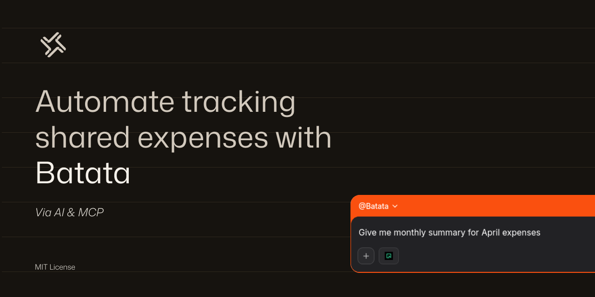

<h1>
AI Expense Tracker for Roommates
</h1>
  
  
<em>Automate tracking shared expenses</em>

A shared expense tracker for two people via an MCP server.
Both users connect Mistral (Le Chat)/Claude/or any other MCP client to the same MCP server → same DB, in my case I connected Mistral to a Neon DB.

---

## Functionalities

`add_expense` Log a shared expense, splits equally or with custom ratio
`get_balance` See who owes whom right now
`list_expenses` Recent expenses, filterable by category
`settle_up` Record a repayment
`monthly_summary` Category breakdown for a given month

---

## 1. Database setup

### Neon

1. Create a project at https://neon.tech
2. Open the **SQL Editor** → paste and run `schema.sql`

---

## 2. Connect MCP to your client (Le chat/Mistral) [all roommates to do this step]

> [!NOTE]
>
> - We're using `https://mcp.neon.tech/sse` for token based auth.
> - in this section, all roommates need to do this step.

1. Go to Mistral (needs an account)
2. Go to Intelligence --> Connectors --> Add a connector (Custom)
   - Connection Server: `https://mcp.neon.tech/sse`
   - Name: `Neon` (can be changed to smth else)
   - Auth method: `API Token Authentication`
3. Press Create

---

## 3. create access tokens for all roommates inside neon (for auth)

> [IMPORTANT]
> Now this might not be the best method since you're sharing your account with someone else, so make sure you trust that person and make sure the Neon project lives on an account that doesn't have sensitive info, I just did this since its the laziest method in my mind, and I trust my roommate.

1. In Neon, go to your account settings (from profile)
2. Go to API Keys
3. Create an access key for each roommate, if they are X then X access keys, and give it to each one.

---

## 4. Complete the connection & create the agent. [all roommates to do this step]

1. in Le Chat, press `connect`, this will prompt you to add your access token (the one from Neon), each user needs to add their own token.
2. Now go to Agents, create a new Agent,
   1. name: `Batata`
   2. Instructions: Paste `sys-prompt.md`
   3. play with other paramaters to your liking
   4. in knowledge, use the Neon MCP connector
      **Note:** sharing agents requires paid account, each user can create his agent with the same settings if suitable.

---

## 5. Configure your names

In agent chat:

1. `connect to neon, and list roommates schema`
2. `Insert Roommates` with their data.

---

## 6. Usage examples

1. `Insert Roommates`
2. insert receipt pic without text
3. `list all roommates`
4. `list all expenses so far`
5. `generate monthly summary`
